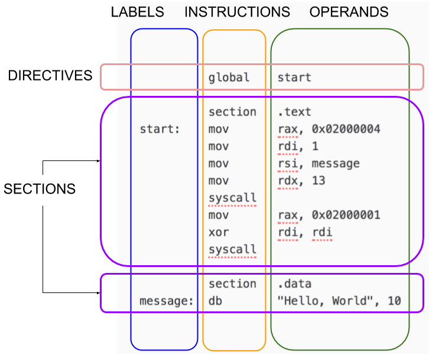
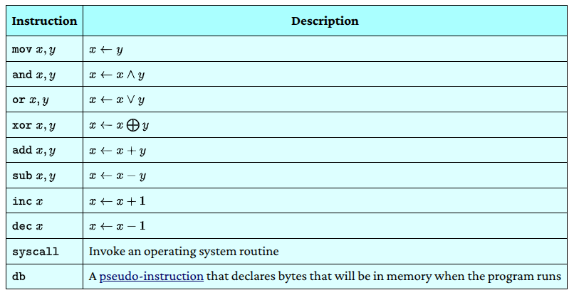

# NASM Tutorial

# Your First Program

Before learning any details, let’s make sure you can type in and run programs.

Make sure both nasm and gcc are installed. Save one of the following programs as hello.asm, depending on your machine platform. Then run the program according to the given instructions.

If you are on a Linux-based OS:

hello.asm
```asm
; ----------------------------------------------------------------------------------------
; Writes "Hello, World" to the console using only system calls. Runs on 64-bit Linux only.
; To assemble and run:
;
;     nasm -felf64 hello.asm && ld hello.o && ./a.out
; ----------------------------------------------------------------------------------------

          global    _start

          section   .text
_start:   mov       rax, 1                  ; system call for write
          mov       rdi, 1                  ; file handle 1 is stdout
          mov       rsi, message            ; address of string to output
          mov       rdx, 13                 ; number of bytes
          syscall                           ; invoke operating system to do the write
          mov       rax, 60                 ; system call for exit
          xor       rdi, rdi                ; exit code 0
          syscall                           ; invoke operating system to exit

          section   .data
message:  db        "Hello, World", 10      ; note the newline at the end
```


```bash
$ nasm -felf64 hello.asm && ld hello.o && ./a.out
Hello, World
```

# Structure of a NASM Program
NASM is line-based. Most programs consist of directives followed by one or more sections. Lines can have an optional label. Most lines have an instruction followed by zero or more operands.


Generally, you put code in a section called .text and your constant data in a section called .data.

# Your First Few Instructions
There are hundreds of instructions. You can’t learn them all at once. Just start with these:


# The Three Kinds of Operands
## Register Operands

